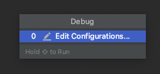
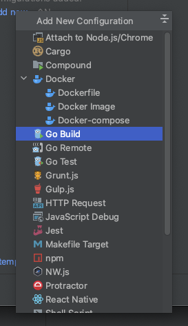
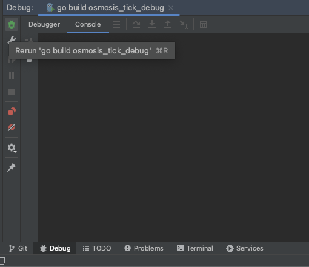
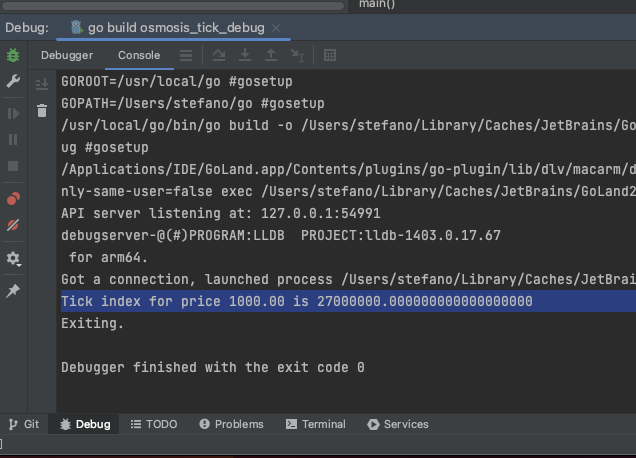

## Usage

In the root of the project run:
```bash
go run main.go <price>
```

In `main.go` file you can change the method you want to use by renaming it in `main`.

There is an implementation using `CalculatePriceToTickDec` and one using `CalculateSqrtPriceToTick`.

## Debug

With GoLand:

1. 
2. 
3. 
4. 
5. 
